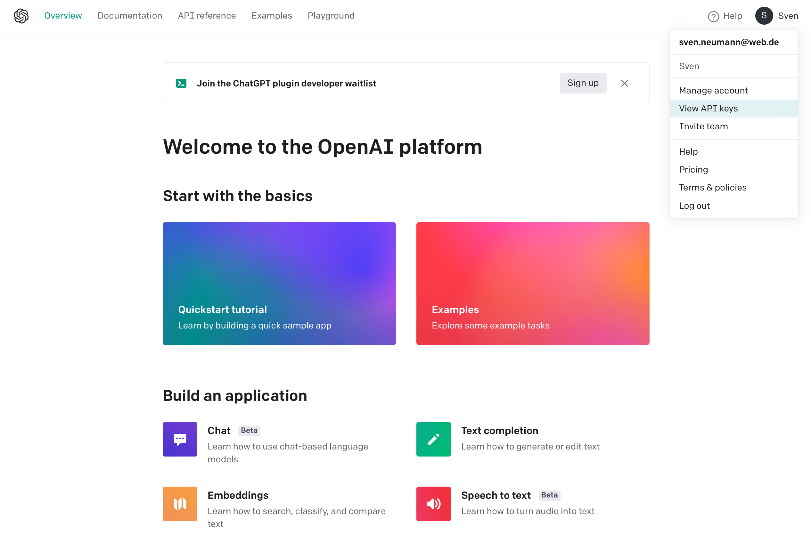
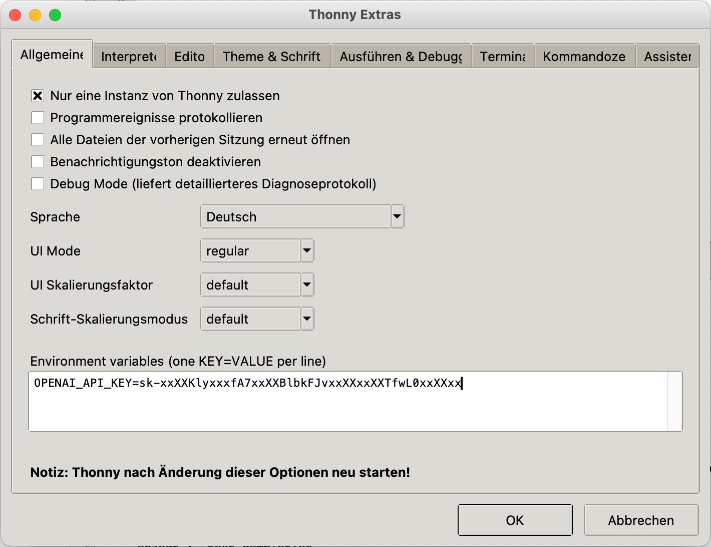
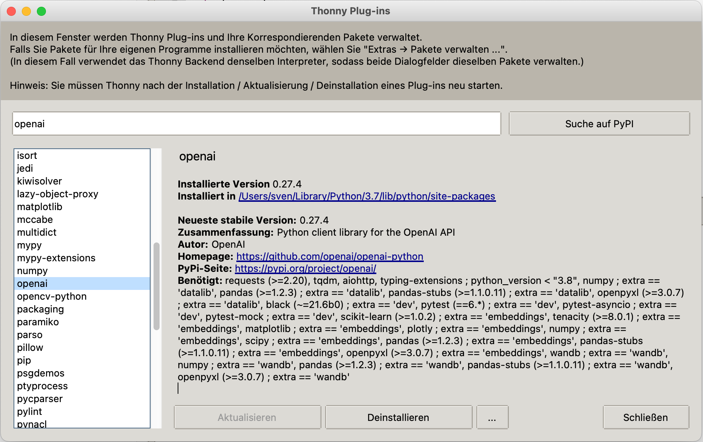

# chatgpt
ChatGPT API in Python benutzen

Als erstes muss du dich auf der Platform von OpenAI registrieren.

[OpenAI API](https://platform.openai.com)

Den API-KEY findest du in den Account-Einstellungen unter <View API keys> dort kannst
du API-KEYS erzeugen und verwalten. Wenn deine Testzeit abgelaufen ist muss leider die
Kreditkarte herhalten, und du must <Billing->Payment methods> die Zahlungsdaten hinterlegen.



In Thonny unter <Extras->Optionen...> im Register <Allgemein> kannst du eine Environment
Variable mit dem Namen <OPENAI_API_KEY> anlegen und mit deinem API-KEY belegen.



Als nächstes solltes du unter <Extras->Verwalte Plug-ins...> das Paket <openai> suchen
und installieren.



Jetzt solltes du das folgende Pythonscript ausführen können.

```python
import os
import openai

openai.api_key = os.getenv('OPENAI_API_KEY')

prompt = input("Frage:\n")

response = openai.ChatCompletion.create(model='gpt-3.5-turbo', messages=[
    {'role': 'user',
     'content': f'{prompt}'}
    ])

print("Antwort:")
print(response['choices'][0]['message']['content'])
```

Die Ausgabe sieht folgendermaßen aus:

```python
>>> %Run sample00.py
Frage:
Wie lang ist die Weser?
Antwort:
Die Weser ist etwa 452 Kilometer lang.
>>> 
```